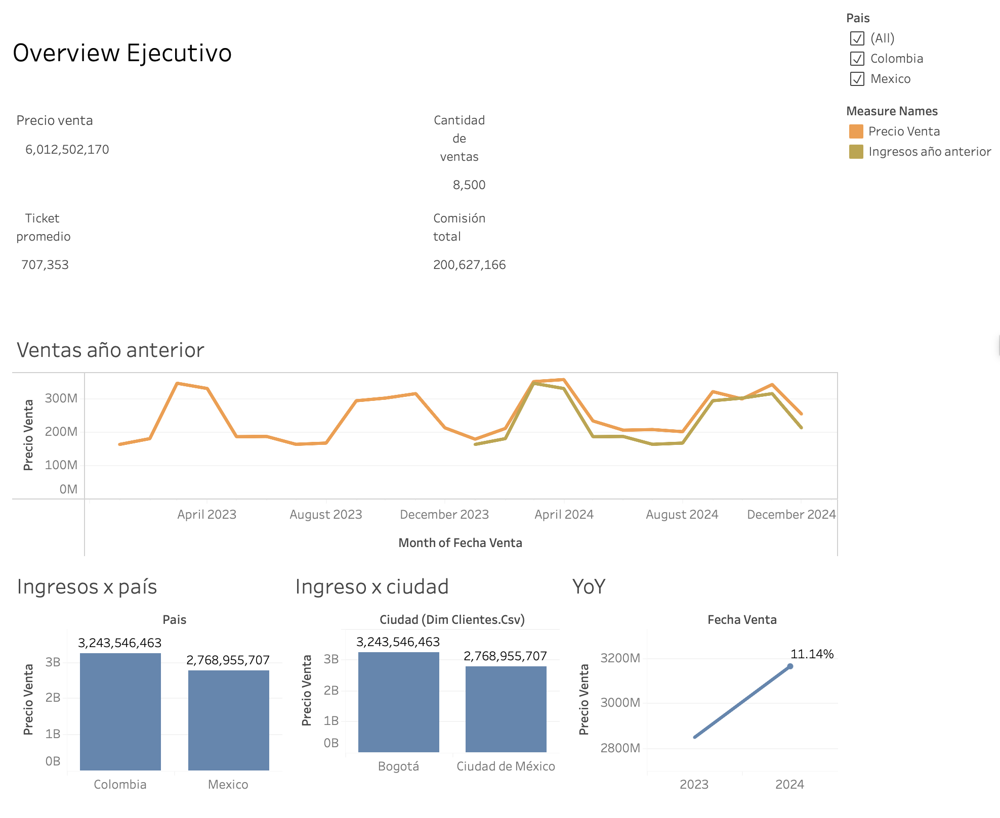

# Analisis-Comercial-Inmobiliario

👉 [Ver el dashboard interactivo en Tableau Public](https://public.tableau.com/views/S11TripleTen/OverviewEjecutivo?:language=en-US&:sid=&:redirect=auth&:display_count=n&:origin=viz_share_link)
# Analisis-Comercial-Inmobiliario Dashboard

## Objetivo

Dashboard de ventas de una cartera inmobiliaria en Colombia y México entre enero de 2023 y diciembre de 2024. Está pensado para equipos comerciales y de dirección que necesitan ver de un vistazo los ingresos, el ticket promedio y las comisiones, y entender qué tipos de propiedad, canales y segmentos de comprador generan más valor.

**Preguntas que responde el dashboard:**

- ¿Cómo evolucionaron los ingresos entre 2023 y 2024 y cuál es el crecimiento interanual (YoY)?
- ¿Qué países, ciudades y tipos de propiedad aportan más ingresos y qué ticket promedio tiene cada uno?
- ¿Qué canal de venta (Corredor o Directo) y qué segmento de comprador (Primera vez, Inversionista, Alto patrimonio) pesan más?
- ¿Cómo es la estacionalidad de las ventas a lo largo del año?

## Datos

- **Periodo:** enero de 2023 a diciembre de 2024
- **Tamaño:** 8.500 ventas
- **Variables principales:** Id Venta, Fecha Venta, Precio Venta, Tipo Propiedad (Casa / Comercial / Departamento), Canal Venta (Corredor / Directo), Segmento Comprador, País, Ciudad, Comisión

## Herramientas

- Tableau Public
- [Excel / SQL / Python]

## Contenido del dashboard

- **Overview Ejecutivo:** KPI, comparación de ventas mensuales con el año anterior, ingresos por país y por ciudad, y crecimiento YoY.
- **Análisis Comercial:** tabla por tipo de propiedad (nº de ventas, precio de venta y ticket promedio) y barras del porcentaje sobre el total por segmento de comprador, canal de venta y tipo de propiedad.
- **Análisis de Cohortes:** matriz de ingresos por mes y año (2023 vs. 2024) con mapa de calor y gráfico de líneas.
- **Filtros interactivos:** país, tipo de propiedad, canal de venta y segmento de comprador.
- **Indicadores clave (KPI):**
  - Precio de venta total: 6.012.502.170
  - Cantidad de ventas: 8.500
  - Ticket promedio: 707.353
  - Comisión total: 200.627.166 (≈ 3,3 % de las ventas)
  - Total YTD y crecimiento YoY: 11,14 %

## Principales conclusiones

- **Crecimiento sólido:** las ventas pasaron de 2.848 M en 2023 a 3.165 M en 2024, un +11,14 % interanual.
- **Todo el crecimiento llega desde abril:** entre enero y marzo de 2024 las ventas cayeron un 4 % frente al mismo periodo de 2023, mientras que de abril a diciembre subieron un 23 %.
- **Colombia lidera:** aporta 3.244 M (54 %) frente a 2.769 M (46 %) de México.
- **Fuerte estacionalidad:** marzo y abril concentran cerca de un tercio de los ingresos anuales. Diciembre es el mes más flojo en ambos años (71 M en 2023 y 102 M en 2024).
- **Casa lidera en ingresos, Departamento en volumen:** las casas suman 2.241 M (37 %) con 2.324 ventas. Los departamentos son el 60 % de las operaciones (5.105) pero solo aportan el 31 % de los ingresos.
- **Comercial tiene el ticket más alto:** 1,80 M por venta, casi cinco veces el del departamento (362 K).
- **El comprador de primera vez es el mayor segmento:** aporta el 63 % de los ingresos (3.784 M), frente al 24 % de los inversionistas y el 13 % de alto patrimonio.
- **El canal Corredor domina:** concentra el 73 % de los ingresos frente al 27 % del canal Directo.

## Aprendizajes

- Limpieza y modelado de datos (tablas de hechos y dimensiones).
- Cálculo de KPI y medidas de negocio (ticket promedio, comisión, YTD, YoY, ventas del año anterior).
- Análisis de estacionalidad y comparación interanual.
- Segmentación por canal, tipo de propiedad y perfil de comprador.
- Diseño de un dashboard ejecutivo con filtros interactivos.
- Storytelling con datos orientado a decisión.

## Contacto

- LinkedIn: (https://www.linkedin.com/in/emma-solorzano-hernandez-jauregui-200301345/)
- Perfil de Tableau Public: https://public.tableau.com/views/S11TripleTen/OverviewEjecutivo?:language=en-US&:sid=&:redirect=auth&:display_count=n&:origin=viz_share_link
